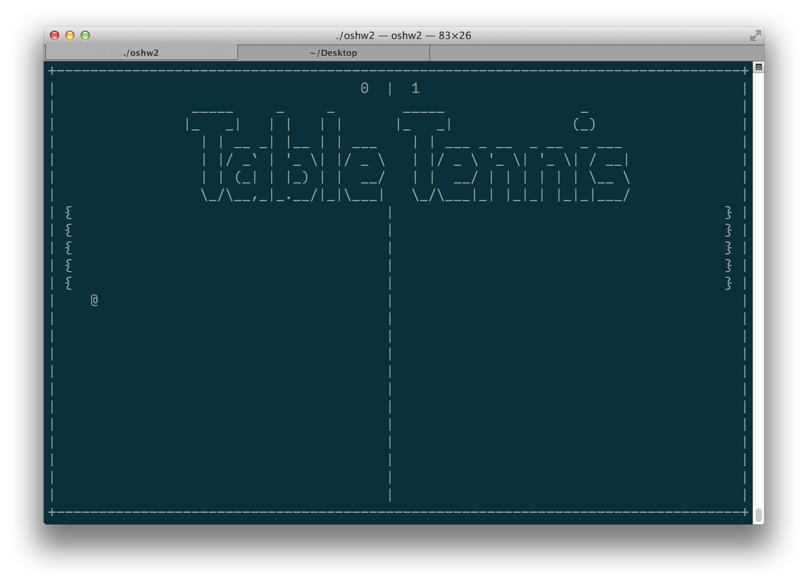

#OSHW2 執行序
## build & run
	gcc oshw2.c -o oshw2 -lcurses -lncurses && ./oshw2
以下為相依性lib必須加在後面compile不然會死

	-lcurses
	-lncurses
	
##特色
	1. responsive design
	2. 好玩
	3. 不會玩到破台
	4. 可以破壞友誼
	5. 會有跑馬燈跑來跑去唷！
	6. 球速可以調，WOOWOOOOO
##Responsive Terminal Game Window
responsive table teenis 做好囉！

可以拉來拉去

上上下下拉好棒棒

左左右右好好玩
##說明
player 1

	上 => w
	下 => s
	
player 2

	上 => i
	下 => k
	
控制

	r => 球球減速
	t => 球球加速
	
規則

	@  是 球
	{  是 球拍
	} 也是 球拍
	
	打掛別人就好

得分

	1. 碰到對方牆壁
	2. 球塞進對方球拍裡面會瘋狂得分，唷！
	
##預覽

##參考
教你如何在terminal畫圖，windows不保證。

畢竟我不用windows嘛。

	http://viget.com/extend/c-games-in-ncurses-using-multiple-windows
	
	